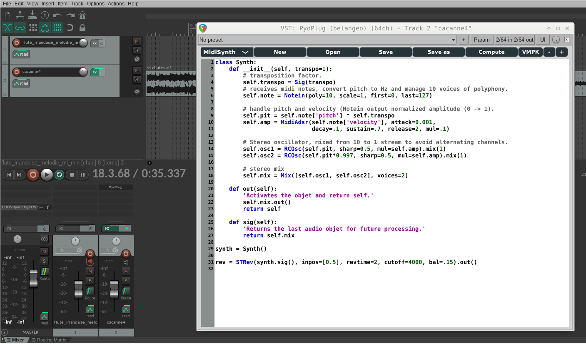

=====================================================================
PyoPlug - Audio plugin using the python module pyo to create the dsp.
=====================================================================

This plug-in allows the user to build his own signal processing chains with the python module **pyo**.
It presents a text editor to write code that can be compiled on the fly.

Installation
------------

Python 3.7 64-bit and pyo must be installed on the system before using PyoPlug.

`Python 3.7 download page <https://www.python.org/downloads/release/python-379/>`_

To install pyo on MacOS, open a Terminal and:

```
sudo python3 -m pip install pyo
```

To install pyo on Windows, open a Command Prompt and:
    
```
py -3.7 -m pip install pyo
```

Then, download the plugin from the `Release page <https://github.com/belangeo/pyo-plug/releases>`_ 
and save it in the local VST folder of the system.

**If you use Reaper on MacOS, in order to be able to use space and return keys in the
code editor, you need to open the Fx chain window where is your plugin (right-click
on the plugin name in the mixer and choose "Show FX chain"), then right-click on the
plugin name and select "Send all keyboard input to plug-in".**

Screenshot
----------


